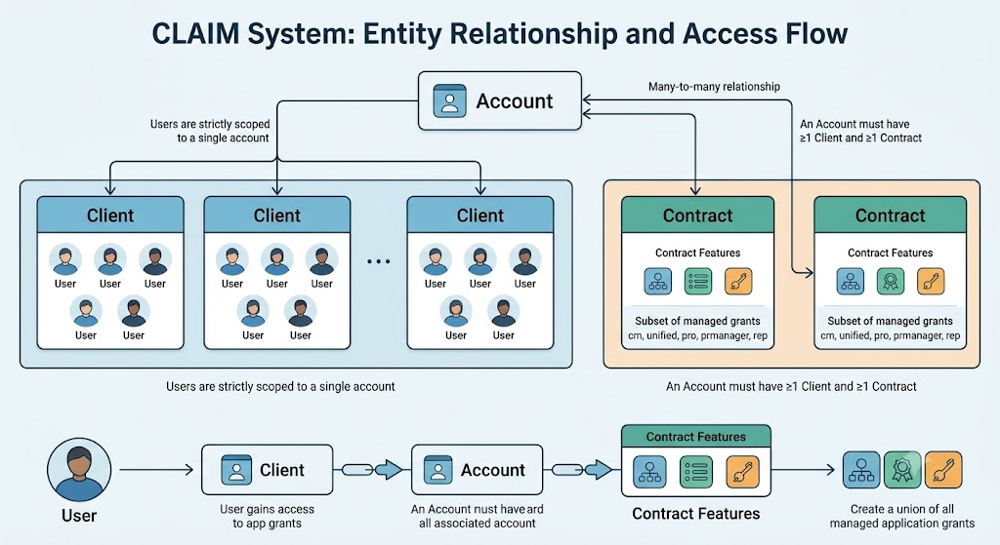

# CLAIM Main Ideas

CLAIM means **Client, Account, and Identity Management**. It is the part of GUM that organizes Onclusive customers, their business units, and the people who use Onclusive applications.




## Main Components

### Account

An Account represents a customer organization or company.

Example: `Acme Corporation`

An Account contains Clients and can have one or more Contracts. It also stores business information such as its name, Salesforce ID, and active or inactive status.

### Client

A Client represents a subdivision, brand, department, or business unit inside an Account.

Example:

```text
Account: Acme Corporation
Clients: Acme US, Acme UK
```

A Client belongs to an Account. A default Client is created as a placeholder when an Account is created.

### User

A User represents an individual person who logs into Onclusive applications.

A User is linked to an Auth0 identity using `auth0UserId`. A User can belong to one or more Clients through the `userClients` relationship.

### Contract

A Contract describes the features and access available to an Account. A Contract is connected to an Account through `accountContracts`.

Contracts can have start and end dates. A Contract is valid only when its dates show that it is currently active.

### Feature

A Feature represents a capability or product entitlement, such as reporting, analytics, or API access.

Features are assigned to Contracts through `contractFeatures`. A feature can map to an application grant, which controls access to an Onclusive application.

### Audit Log

An Audit Log records important changes, such as creating, updating, deleting, restoring, or assigning CLAIM entities. It helps administrators understand what changed, when it changed, and who made the change.

## How Components Relate

```text
Account
  ├── Clients
  │     └── Users
  └── Contracts
        └── Features
              └── Application grants
```

The User-to-Client relationship is many-to-many:

- One Account can have many Clients.
- One Client can have many Users.
- One User can belong to multiple Clients.
- One Account can have multiple Contracts.
- One Contract can be assigned to multiple Accounts.
- One Contract can have multiple Features.

## Example

```text
Account: Acme Corporation
  ├── Client: Acme US
  │     ├── User: Jane
  │     └── User: Mark
  ├── Client: Acme UK
  │     └── User: Jane
  └── Contract: Premium
        ├── Feature: Analytics
        └── Feature: API Access
```

Jane belongs to two Clients in the same Account. The Account's Premium Contract provides Features that can give its Users access to applications.

## Account Activation

An Account can be active only when its required setup is complete. The main requirements are:

- A Contract is assigned.
- At least one Contract is currently valid.
- At least one enabled Feature is available.
- A non-default Client exists.
- At least one User is assigned to a Client.

CLAIM can automatically deactivate an Account when requirements are no longer met. It does not automatically activate an Account; an Editor must activate it manually.

## Soft Delete

Accounts, Clients, Users, Contracts, and Features use soft deletion. Soft deletion sets `deletedAt` instead of permanently removing the record. This preserves history and allows supported records to be restored.

Relationship tables such as `userClients`, `accountContracts`, and `contractFeatures` represent links and can be removed when an association is changed.

## CLAIM and Auth0

CLAIM and Auth0 have different responsibilities:

- **CLAIM database:** Accounts, Clients, Contracts, Features, User relationships, and audit history.
- **Auth0:** Login, passwords, Auth0 identities, roles, MFA, and application grants.
- **Both systems:** User name and email, which must be kept synchronized.

The local CLAIM User is linked to Auth0 with `auth0UserId`. CLAIM also stores its local User ID in Auth0 metadata as `gum_user_id`:

```json
{
  "user_metadata": {
    "gum_user_id": 123
  }
}
```

In simple terms, CLAIM manages the customer structure and relationships, while Auth0 manages identity and authentication.
