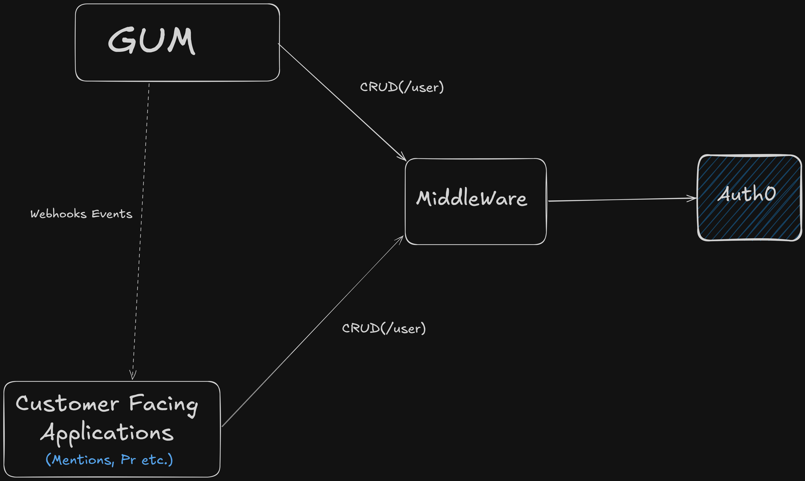
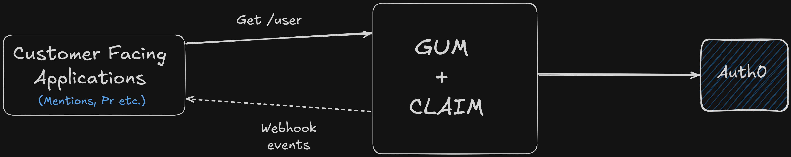

# Auth0 Overview

Auth0 is an **Identity-as-a-Service (IDaaS)** platform—a cloud service that manages user authentication and identity verification for software applications.

Instead of building login systems, password management, multi-factor authentication, and single sign-on logic from scratch, Onclusive integrates Auth0 to securely handle identity verification across customer-facing services.

## Key Points

* **Password Outsourcing:** Individual Onclusive applications do not store user passwords in their local databases. Password storage and password-reset flows are managed entirely by Auth0.

* **Application Access Grants:** Application access is tracked centrally in Auth0 user metadata.

* **Local Roles vs. Central Identity:** Auth0 determines **who the user is** and **which applications they have access to**. Internal roles, workspace permissions, and business-specific data remain stored in each application's local database.

### Combined Metadata Structure

The following metadata structure is returned by `/user/metadata`:

```json
{
  "lang": "en",
  "applications": [
    { "application": "gum" },
    { "application": "analyst" },
    { "application": "prmanager" },
    { "application": "rep" }
  ]
}
```

---

# Auth0 API Middleware

To centralize user authentication and application access grants across products without creating duplicate accounts or unintentionally deleting existing accounts, Onclusive built a custom **API Middleware**.

The middleware acts as a stateless wrapper around the Auth0 Management API. It provides simple endpoints for individual applications to use while applying Onclusive-specific business rules.

## 1. POST `/token` — Server Authorization

**Purpose:** Called **backend-to-backend** by an individual application's server using the OAuth 2.0 Client Credentials Grant to obtain a short-lived `access_token`. This token must be included in subsequent middleware API calls to authorize the request.

### Example Request

```json
{
  "client_id": "<CLIENT_ID>",
  "client_secret": "<CLIENT_SECRET>",
  "audience": "https://<AUTH0_DOMAIN>/api/v2/",
  "grant_type": "client_credentials",
  "application_api": "https://<AUTH0_DOMAIN>"
}
```

### Example Response

```json
{
  "statusCode": 200,
  "message": "Management API Access Token",
  "access_token": "<ACCESS_TOKEN>"
}
```

## 2. POST `/user` — User Provisioning and Access Granting

**Purpose:** Called by an application backend to provision a new user or grant application access to an existing user.

### Middleware Logic

1. **New User:** If the user does not exist in Auth0, the middleware provisions a new Auth0 identity using `email`, `name`, `temp_password`, and `lang`. It sets the default metadata and adds the target application to `app_metadata.applications`. Auth0 then sends a localized email containing a password setup link.

2. **Existing User:** If the email already exists in Auth0 because the user has access to another Onclusive application, the middleware **does not create a duplicate user or reset the user's password**. Instead, it adds the requesting application to the user's `app_metadata.applications` array and returns the existing canonical `user_id`.

### Example Request

```json
{
  "user_id": "<USER_ID>",
  "email": "user@example.com",
  "name": "Example User",
  "temp_password": "<TEMP_PASSWORD>",
  "email_verified": true,
  "lang": "es",
  "client_id": "<CLIENT_ID>",
  "connection": "<AUTH0_CONNECTION>",
  "application_api": "https://<AUTH0_DOMAIN>",
  "access_token": "<ACCESS_TOKEN>"
}
```

### Example Response — Granting Access to an Existing User

```json
{
  "statusCode": 200,
  "user_id": "<USER_ID>",
  "message": "Granted access to existing user.",
  "action": "updated"
}
```

## 3. PATCH `/user` — Updating User Details and Metadata

**Purpose:** Called by an application backend to update existing user attributes in Auth0, such as the primary email address, display name, password, or language preference (`lang`).

### Middleware Logic

* Locates the user using `current_email` and updates the specified user attributes.
* **Language Handling (`lang`):** Supported language codes are `en` (default), `es`, `fr-FR`, `de`, `it`, and `zh-CN`.
* If `lang` is omitted or passed as an empty string, the existing language preference in Auth0 remains unchanged.

### Example Request

```json
{
  "current_email": "user@example.com",
  "email": "user+newemail@example.com",
  "name": "Example User",
  "password": "<PASSWORD>",
  "lang": "es",
  "client_id": "<CLIENT_ID>",
  "application_api": "https://<AUTH0_DOMAIN>",
  "access_token": "<ACCESS_TOKEN>"
}
```

## 4. DELETE `/user` — Revoking Application Access

**Purpose:** Called by an application backend to revoke a user's access to that specific application.

### Middleware Logic

1. **Multi-App User — Conditional Access Revocation:** The middleware checks `app_metadata.applications`. If the user has access to other Onclusive applications, the delete operation is converted into an update that removes only the requesting application's grant while preserving the user's central Auth0 account.

2. **Single-App User — Hard Delete:** If no other active application grants remain in `app_metadata`, the middleware performs a full hard delete of the user record from Auth0.

### Example Request

```json
{
  "current_email": "user@example.com",
  "client_id": "<CLIENT_ID>",
  "application_api": "https://<AUTH0_DOMAIN>",
  "access_token": "<ACCESS_TOKEN>"
}
```

### Example Response

```json
{
  "statusCode": 200,
  "message": "Removed application access for this user."
}
```

---

# Global User Management (GUM)

**Global User Management (GUM)** is a centralized hub for managing user accounts and application access across Onclusive applications.

GUM uses the same **Auth0 API Middleware** to perform actions on Auth0 user records.

It provides a single interface for user management and notifies individual applications about changes made to user records through webhooks. This allows applications to update their local records accordingly.

## Webhook Events

GUM sends webhook events to applications for the following types of changes:

* `update.user_email` — The user's email address was changed.
* `update.user_name` — The user's name was changed.
* `create.grant` — The user was granted access to an application.
* `delete.grant` — The user's access to an application was revoked.

## Auth0 as the Source of Truth

Individual applications can still call the Middleware APIs to update user records directly, as **Auth0 is the single source of truth for central user identity and application access**.

Therefore, when a user navigates to GUM, they will see the latest user and access information stored in Auth0.




---

# Client, Account, and Identity Management (CLAIM)

CLAIM stands for **Client, Account, and Identity Management**. It extends GUM with a local data model for managing customer organizations, business units, user identities, contracts, features, and application access.

## Main Components

* **Account:** Represents a customer organization.
* **Client:** Represents a business unit, workspace, or brand within an Account.
* **User:** Represents an individual who accesses Onclusive applications.
* **Contract:** Defines the features and application access purchased by an Account.
* **Feature:** Represents a capability provided through a Contract.
* **Application Grant:** Represents access to a specific Onclusive application.

## How They Relate

```text
Account
 ├── Clients
 │    └── Users
 │
 └── Contracts
      └── Features
           └── Application Grants
```

Contracts belong to **Accounts**, not directly to Clients. Therefore, all Clients under the same Account have access to the features provided by that Account's Contracts.

A User can belong to multiple Clients, but those Clients must belong to the same Account.

## Access Flow

```text
User
  -> Client
  -> Account
  -> Contract
  -> Enabled Feature
  -> Application Grant
  -> Auth0 Application Access
```

GUM calculates a User's effective application access based on the Account's Contracts and their enabled Features. It then synchronizes the applicable application grants with Auth0.

## CLAIM and Auth0

* **CLAIM database:** Stores Accounts, Clients, Users, Contracts, Features, User relationships, and audit history.
* **Auth0:** Manages authentication, passwords, identities, roles, MFA, and application access.
* **Both systems:** Store the User's name and email address, which must remain synchronized.

The local CLAIM User is linked to Auth0 using `auth0UserId`. CLAIM also stores its local User ID in Auth0 as `user_metadata.gum_user_id`.

## Application Synchronization

When relevant data changes in GUM, such as a User, Account, Client, Contract, Feature, or application grant, GUM can send webhook events to affected integrated applications. Those applications then update their local shadow records asynchronously.

## Example

Suppose an Account has two Clients and two Contracts:

```text
Account: Acme Corporation

 ├── Client 1
 │    └── User A
 │
 ├── Client 2
 │    └── User B
 │
 ├── Contract A
 │    └── Feature A
 │
 └── Contract B
      └── Feature B
```

In the current CLAIM model, Contracts belong to the **Account**, not directly to individual Clients.

Therefore:

* User A is assigned to Client 1.
* User B is assigned to Client 2.
* Client 1 and Client 2 both belong to Acme Corporation.
* Contract A and Contract B are both assigned to Acme Corporation.
* Both users have access to the features provided by both Contracts.

```text
User A -> Feature A and Feature B

User B -> Feature A and Feature B
```

The current model does **not** support the following structure:

```text
Client 1 -> Contract A -> User A gets Feature A

Client 2 -> Contract B -> User B gets Feature B
```

Supporting this structure would require Contracts to be assigned directly to Clients, or for Client-level feature overrides to be fully implemented.

The `featureOverrides` field exists on the Client model, but this functionality is currently reserved for a future implementation.




---

## References & Sources
* **Source Code Repository:** [`gum/claim` Repository](https://github.com/AirPR/gum/tree/claim)
* **Related Documentation:**
  * [Onclusive Auth0 Integration & Overview](https://onclusive.atlassian.net/wiki/spaces/Applicatio/pages/5027102781/Onclusive+Auth0+Integration+Overview)
  * [Client Account and Identity Management](https://onclusive.atlassian.net/wiki/spaces/EDA/pages/4889083912/Client+Account+and+Identity+Management)
